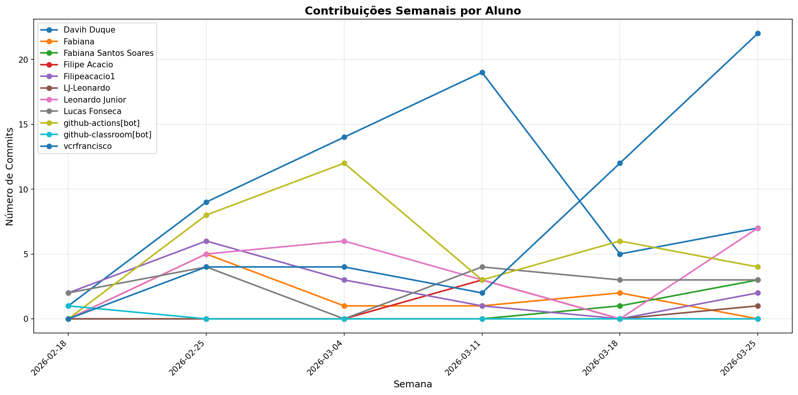

# 📊 Relatório de Contribuições do Projeto

**Última atualização:** 01/04/2026 17:37

---

## 📈 Resumo Geral de Contribuições

| Aluno                 |   Commits |   Linhas+ |   Linhas- |   Arquivos |   Docs Commits |   Docs Arquivos |
|-----------------------|-----------|-----------|-----------|------------|----------------|-----------------|
| Davih Duque           |        55 |     17133 |      8324 |         65 |             22 |               4 |
| Fabiana               |         9 |        17 |        16 |          2 |              9 |               2 |
| Fabiana Santos Soares |         4 |       554 |        72 |          9 |              0 |               0 |
| Filipe Acacio         |         3 |       399 |       122 |         15 |              0 |               0 |
| Filipeacacio1         |        14 |        51 |        44 |          3 |             14 |               3 |
| LJ-Leonardo           |         1 |      4521 |       211 |          8 |              0 |               0 |
| Leonardo Junior       |        21 |        66 |        68 |          7 |             15 |               3 |
| Lucas Fonseca         |        16 |       510 |       171 |         14 |             11 |               2 |
| github-actions[bot]   |        33 |       231 |       226 |          3 |             33 |               1 |
| github-classroom[bot] |         1 |      2152 |         0 |         45 |              1 |              13 |
| vcrfrancisco          |        44 |      1907 |     10327 |         92 |             15 |               2 |

## 📅 Contribuições Semanais (Todo o Semestre)

**2026-03-25**: Davih Duque: 7, Fabiana Santos Soares: 3, Filipeacacio1: 2, LJ-Leonardo: 1, Leonardo Junior: 7, Lucas Fonseca: 3, github-actions[bot]: 4, vcrfrancisco: 22

**2026-03-18**: Davih Duque: 5, Fabiana: 2, Fabiana Santos Soares: 1, Lucas Fonseca: 3, github-actions[bot]: 6, vcrfrancisco: 12

**2026-03-11**: Davih Duque: 19, Fabiana: 1, Filipe Acacio: 3, Filipeacacio1: 1, Leonardo Junior: 3, Lucas Fonseca: 4, github-actions[bot]: 3, vcrfrancisco: 2

**2026-03-04**: Davih Duque: 14, Fabiana: 1, Filipeacacio1: 3, Leonardo Junior: 6, github-actions[bot]: 12, vcrfrancisco: 4

**2026-02-25**: Davih Duque: 9, Fabiana: 5, Filipeacacio1: 6, Leonardo Junior: 5, Lucas Fonseca: 4, github-actions[bot]: 8, vcrfrancisco: 4

**2026-02-18**: Davih Duque: 1, Filipeacacio1: 2, Lucas Fonseca: 2, github-classroom[bot]: 1

## 📊 Visualização Gráfica

## ℹ️ Observações

- **Commits**: Número total de commits realizados

- **Linhas+**: Linhas de código adicionadas

- **Linhas-**: Linhas de código removidas

- **Arquivos**: Número de arquivos únicos modificados

- **Docs Commits**: Commits em arquivos de documentação

- **Docs Arquivos**: Arquivos de documentação modificados

---

*Relatório gerado automaticamente via GitHub Actions*
