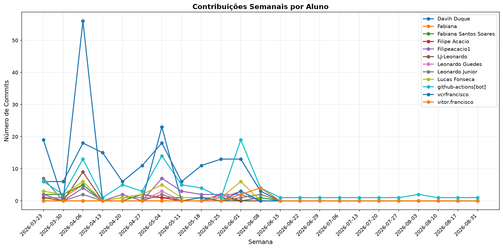

# 📊 Relatório de Contribuições do Projeto

**Última atualização:** 11/05/2026 00:55

---

## 📈 Resumo Geral de Contribuições

| Aluno                 |   Commits |   Linhas+ |   Linhas- |   Arquivos |   Docs Commits |   Docs Arquivos |
|-----------------------|-----------|-----------|-----------|------------|----------------|-----------------|
| Davih Duque           |       123 |     20798 |      9417 |        171 |             37 |               5 |
| Fabiana               |        18 |        56 |        29 |          3 |             18 |               3 |
| Fabiana Santos Soares |        12 |      1326 |       423 |         22 |              0 |               0 |
| Filipe Acacio         |         7 |       845 |       328 |         21 |              0 |               0 |
| Filipeacacio1         |        27 |      1137 |       527 |         20 |             20 |               5 |
| LJ-Leonardo           |        10 |      6250 |       688 |         17 |              3 |               1 |
| Leonardo Guedes       |         3 |       941 |       203 |         36 |              2 |               2 |
| Leonardo Junior       |        25 |        74 |        76 |          7 |             19 |               3 |
| Lucas Fonseca         |        31 |      6538 |       854 |         55 |             19 |               4 |
| github-actions[bot]   |        71 |       639 |       621 |          3 |             71 |               1 |
| github-classroom[bot] |         1 |      2152 |         0 |         45 |              1 |              13 |
| vcrfrancisco          |       111 |      8429 |      1971 |        111 |             21 |               5 |

## 📅 Contribuições Semanais (Todo o Semestre)

**2026-05-04**: Davih Duque: 18, Fabiana: 1, Fabiana Santos Soares: 1, Filipe Acacio: 1, Filipeacacio1: 7, Leonardo Guedes: 3, Leonardo Junior: 2, Lucas Fonseca: 5, github-actions[bot]: 13, vcrfrancisco: 23

**2026-04-27**: Davih Duque: 11, Fabiana: 1, Fabiana Santos Soares: 2, Filipe Acacio: 2, Lucas Fonseca: 2, github-actions[bot]: 3

**2026-04-20**: Davih Duque: 6, Fabiana: 1, Filipe Acacio: 1, Filipeacacio1: 2, Lucas Fonseca: 1, github-actions[bot]: 5

**2026-04-13**: Davih Duque: 15, github-actions[bot]: 1

**2026-04-06**: Davih Duque: 18, Fabiana: 5, Fabiana Santos Soares: 5, Filipeacacio1: 4, LJ-Leonardo: 9, Leonardo Junior: 2, Lucas Fonseca: 6, github-actions[bot]: 13, vcrfrancisco: 56

**2026-03-30**: Davih Duque: 6, Fabiana: 1, Fabiana Santos Soares: 2, Lucas Fonseca: 2, github-actions[bot]: 3

**2026-03-23**: Davih Duque: 6, Fabiana: 1, Fabiana Santos Soares: 2, Filipeacacio1: 2, LJ-Leonardo: 1, Leonardo Junior: 7, Lucas Fonseca: 3, github-actions[bot]: 6, vcrfrancisco: 19

**2026-03-16**: Davih Duque: 12, Fabiana: 1, Filipe Acacio: 2, Filipeacacio1: 1, Leonardo Junior: 1, Lucas Fonseca: 4, github-actions[bot]: 7, vcrfrancisco: 3

**2026-03-09**: Davih Duque: 8, Fabiana: 1, Filipe Acacio: 1, Filipeacacio1: 1, Leonardo Junior: 2, Lucas Fonseca: 2, github-actions[bot]: 1, vcrfrancisco: 2

**2026-03-02**: Davih Duque: 16, Fabiana: 1, Filipeacacio1: 2, Leonardo Junior: 11, github-actions[bot]: 19, vcrfrancisco: 4

**2026-02-23**: Davih Duque: 7, Fabiana: 5, Filipeacacio1: 8, Lucas Fonseca: 6, vcrfrancisco: 4

**2026-02-16**: github-classroom[bot]: 1

## 📊 Visualização Gráfica

## ℹ️ Observações

- **Commits**: Número total de commits realizados

- **Linhas+**: Linhas de código adicionadas

- **Linhas-**: Linhas de código removidas

- **Arquivos**: Número de arquivos únicos modificados

- **Docs Commits**: Commits em arquivos de documentação

- **Docs Arquivos**: Arquivos de documentação modificados

---

*Relatório gerado automaticamente via GitHub Actions*
