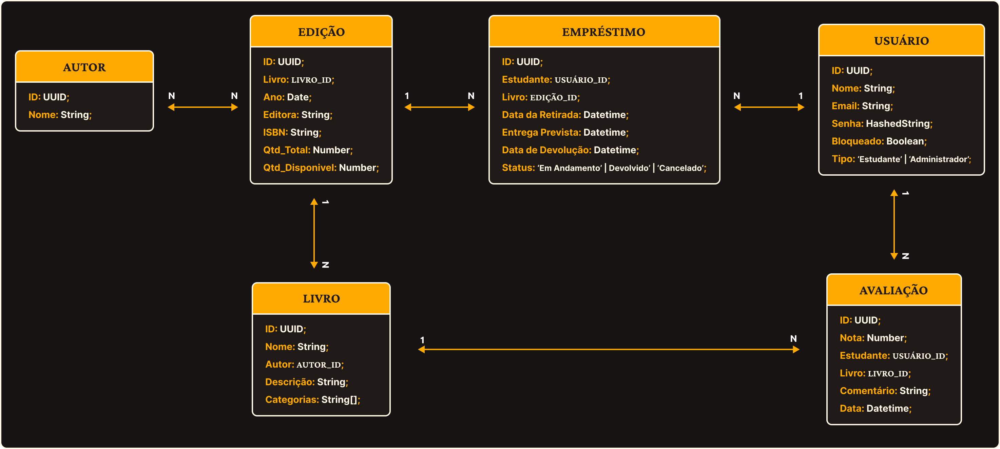

# APIs e Web Services

O planejamento de uma aplicação de APIS Web é uma etapa fundamental para o sucesso do projeto. Ao planejar adequadamente, você pode evitar muitos problemas e garantir que a sua API seja segura, escalável e eficiente.

Aqui estão algumas etapas importantes que devem ser consideradas no planejamento de uma aplicação de APIS Web.

Este projeto consiste no desenvolvimento de uma API de back-end para o sistema de gestão da Biblioteca da Universidade Polaris, responsável por centralizar e gerenciar as operações relacionadas ao acervo, usuários, empréstimos, devoluções e reservas. A aplicação terá como objetivo fornecer uma base robusta e escalável para integração com diferentes interfaces e serviços, automatizando processos da biblioteca e garantindo acesso estruturado às informações por meio de endpoints bem definidos.

## Objetivos da API

Antes de definir os objetivos da API, é importante destacar que o contexto de desenvolvimento considera o uso de um ORM, responsável por intermediar a comunicação entre a aplicação e o banco de dados. Dessa forma, a API não interage diretamente com consultas SQL, mas sim por meio de modelos e operações abstraídas pelo ORM, o que facilita a organização do código, a manutenção do sistema e a possível transição entre diferentes bancos de dados durante a evolução do projeto.

Com isso, os objetivos são:
- Prover uma API RESTful centralizada responsável por intermediar toda a comunicação entre as aplicações cliente e o banco de dados do sistema da Biblioteca Polaris, atuando como o único ponto de entrada para acesso e manipulação das informações.

- Estruturar os recursos da biblioteca em endpoints bem definidos, permitindo o gerenciamento de entidades fundamentais como usuários, materiais do acervo, empréstimos, devoluções e reservas.

- Garantir a separação entre camadas da aplicação, isolando a lógica de negócio no backend e impedindo que interfaces cliente realizem acesso direto ao banco de dados.

- Permitir a integração com múltiplas interfaces (web e mobile), oferecendo um serviço padronizado de acesso às informações da biblioteca.

- Garantir consistência, segurança e confiabilidade das operações, utilizando validações, tratamento de erros e padronização nas respostas da API.

- Facilitar a manutenção e evolução do sistema, permitindo a expansão de funcionalidades e integração com novos serviços sem comprometer a estrutura existente. 

## Modelagem da Aplicação
A modelagem da aplicação segue uma estrutura relacional simples, composta pelas entidades Usuários, Livros, Edições, Autores, Avaliações e Empréstimos. A entidade Empréstimos atua como uma tabela intermediária responsável por registrar cada operação de retirada de uma edição de livro por um usuário. Dessa forma, estabelece-se uma relação 1:N entre usuários e empréstimos, bem como entre edições e empréstimos, o que, na prática, caracteriza uma relação N:N entre usuários e livros ao longo do tempo.

Além disso, a entidade Livros representa a obra em si, enquanto Edições registra diferentes versões ou atualizações de um mesmo livro. A entidade Autores armazena informações sobre os responsáveis pelas obras, e Avaliações permite que usuários registrem comentários e classificações sobre os livros disponíveis no sistema.

Por fim, a entidade Usuários contempla diferentes perfis, como estudante e administrador, permitindo distinguir níveis de acesso e responsabilidades dentro do sistema.

<h4 align="center">  </h4>


## Tecnologias Utilizadas

Existem muitas tecnologias diferentes que podem ser usadas para desenvolver APIs Web. A tecnologia certa para o seu projeto dependerá dos seus objetivos, dos seus clientes e dos recursos que a API deve fornecer.

- Node.js como ambiente de execução do backend.

- Express.js para a construção da API RESTful e gerenciamento das rotas da aplicação.

- TypeScript para adicionar tipagem estática ao projeto, aumentando a segurança e a manutenibilidade do código.

- Prisma ORM para a abstração da camada de persistência e gerenciamento das operações com o banco de dados.

- SQLite como banco de dados no ambiente de desenvolvimento local, facilitando a configuração e execução do projeto.

- MariaDB utilizado no ambiente de produção, hospedado em uma instância na AWS, garantindo maior robustez e disponibilidade para o sistema.

## API Endpoints

[Liste os principais endpoints da API, incluindo as operações disponíveis, os parâmetros esperados e as respostas retornadas.]

### Endpoint 1
- Método: GET
- URL: /endpoint1
- Parâmetros:
  - param1: [descrição]
- Resposta:
  - Sucesso (200 OK)
    ```
    {
      "message": "Success",
      "data": {
        ...
      }
    }
    ```
  - Erro (4XX, 5XX)
    ```
    {
      "message": "Error",
      "error": {
        ...
      }
    }
    ```

## Considerações de Segurança

[Discuta as considerações de segurança relevantes para a aplicação distribuída, como autenticação, autorização, proteção contra ataques, etc.]

## Implantação

[Instruções para implantar a aplicação distribuída em um ambiente de produção.]

1. Defina os requisitos de hardware e software necessários para implantar a aplicação em um ambiente de produção.
2. Escolha uma plataforma de hospedagem adequada, como um provedor de nuvem ou um servidor dedicado.
3. Configure o ambiente de implantação, incluindo a instalação de dependências e configuração de variáveis de ambiente.
4. Faça o deploy da aplicação no ambiente escolhido, seguindo as instruções específicas da plataforma de hospedagem.
5. Realize testes para garantir que a aplicação esteja funcionando corretamente no ambiente de produção.

## Testes

[Descreva a estratégia de teste, incluindo os tipos de teste a serem realizados (unitários, integração, carga, etc.) e as ferramentas a serem utilizadas.]

1. Crie casos de teste para cobrir todos os requisitos funcionais e não funcionais da aplicação.
2. Implemente testes unitários para testar unidades individuais de código, como funções e classes.
3. Realize testes de integração para verificar a interação correta entre os componentes da aplicação.
4. Execute testes de carga para avaliar o desempenho da aplicação sob carga significativa.
5. Utilize ferramentas de teste adequadas, como frameworks de teste e ferramentas de automação de teste, para agilizar o processo de teste.

# Referências

Inclua todas as referências (livros, artigos, sites, etc) utilizados no desenvolvimento do trabalho.
