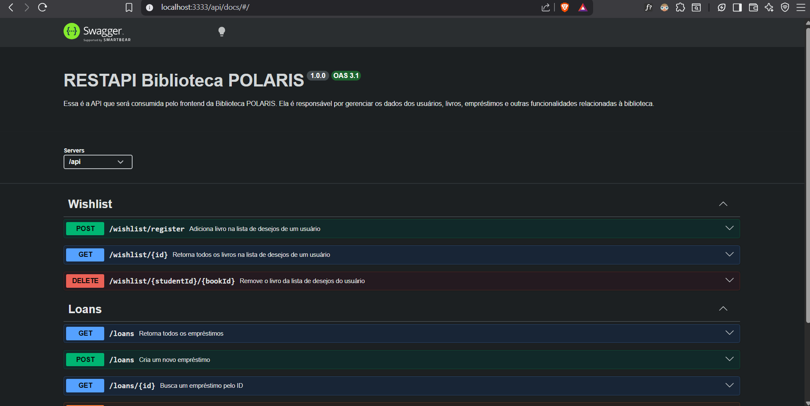

# APIs e Web Services

O planejamento de uma aplicação de APIS Web é uma etapa fundamental para o sucesso do projeto. Ao planejar adequadamente, você pode evitar muitos problemas e garantir que a sua API seja segura, escalável e eficiente.

Aqui estão algumas etapas importantes que devem ser consideradas no planejamento de uma aplicação de APIS Web.

Este projeto consiste no desenvolvimento de uma API de back-end para o sistema de gestão da Biblioteca da Universidade Polaris, responsável por centralizar e gerenciar as operações relacionadas ao acervo, usuários, empréstimos, devoluções e reservas. A aplicação terá como objetivo fornecer uma base robusta e escalável para integração com diferentes interfaces e serviços, automatizando processos da biblioteca e garantindo acesso estruturado às informações por meio de endpoints bem definidos.

## Objetivos da API

Antes de definir os objetivos da API, é importante destacar que o contexto de desenvolvimento considera o uso de um ORM, responsável por intermediar a comunicação entre a aplicação e o banco de dados. Dessa forma, a API não interage diretamente com consultas SQL, mas sim por meio de modelos e operações abstraídas pelo ORM, o que facilita a organização do código, a manutenção do sistema e a possível transição entre diferentes bancos de dados durante a evolução do projeto.

Com isso, os objetivos são:
- Prover uma API RESTful centralizada responsável por intermediar toda a comunicação entre as aplicações cliente e o banco de dados do sistema da Biblioteca Polaris, atuando como o único ponto de entrada para acesso e manipulação das informações.

- Estruturar os recursos da biblioteca em endpoints bem definidos, permitindo o gerenciamento de entidades fundamentais como usuários, materiais do acervo, empréstimos, devoluções e reservas.

- Garantir a separação entre camadas da aplicação, isolando a lógica de negócio no backend e impedindo que interfaces cliente realizem acesso direto ao banco de dados.

- Permitir a integração com múltiplas interfaces (web e mobile), oferecendo um serviço padronizado de acesso às informações da biblioteca.

- Garantir consistência, segurança e confiabilidade das operações, utilizando validações, tratamento de erros e padronização nas respostas da API.

- Facilitar a manutenção e evolução do sistema, permitindo a expansão de funcionalidades e integração com novos serviços sem comprometer a estrutura existente. 

## Modelagem da Aplicação
A modelagem da aplicação segue uma estrutura relacional composta pelas entidades Usuários, Livros, Autores, Empréstimos, Avaliações e Lista de Desejos, organizadas de forma a garantir consistência e rastreabilidade das operações no sistema.

A entidade **Empréstimos** atua como uma tabela intermediária responsável por registrar cada operação de retirada de um livro por um usuário. Dessa forma, estabelece-se uma relação 1:N entre usuários e empréstimos, bem como entre livros e empréstimos, caracterizando, ao longo do tempo, uma relação N:N entre usuários e livros.

Já a entidade **Avaliações** possibilita que os usuários registrem comentários e classificações; entretanto, essas avaliações estão associadas à entidade Empréstimos, e não diretamente aos livros. Essa abordagem garante que apenas usuários que efetivamente realizaram um empréstimo possam avaliar uma obra, reforçando a confiabilidade dos feedbacks registrados no sistema.

A entidade **Livros** representa as obras disponíveis no sistema, enquanto Autores armazena as informações dos responsáveis por essas obras, permitindo a associação entre livros e seus respectivos criadores.

Além disso, a entidade **Lista de Desejos** permite que os usuários salvem livros de interesse para acesso futuro, funcionando como um mecanismo de organização pessoal dentro da plataforma.

Por fim, a entidade Usuários contempla diferentes perfis, como estudante e administrador, possibilitando a definição de níveis de acesso e responsabilidades distintas dentro do sistema.

<h4 align="center">  </h4>


## Tecnologias Utilizadas

Como mencionado anteriormente, possuímos uma separação entre os serviços que compõem o sistema como um todo. No contexto de API/Backend, estamos utilizando a seguinte stack tecnológica, escolhida com base em critérios de escalabilidade e facilidade de manutenção:

- Node.js como ambiente de execução do backend.

- Express.js para a construção da API RESTful e gerenciamento das rotas da aplicação.

- TypeScript para adicionar tipagem estática ao projeto, aumentando a segurança e a manutenibilidade do código.

- Prisma ORM para a abstração da camada de persistência e gerenciamento das operações com o banco de dados.

- SQLite como banco de dados no ambiente de desenvolvimento local, facilitando a configuração e execução do projeto.

- MariaDB utilizado no ambiente de produção, hospedado em uma instância na AWS, garantindo maior robustez e disponibilidade para o sistema.

## API Endpoints

Os endpoints da aplicação podem ser avaliados executando o projeto conforme descrito na documentação localizada em [`./src/server/Readme.md`](../src/server/Readme.md).

Após iniciar o servidor, acesse a interface interativa da API pelo seguinte link: [http://localhost:3333/docs](http://localhost:3333/docs)

Nessa página, você poderá visualizar todos os endpoints disponíveis, organizados por tipo, além de testá-los diretamente de forma prática.

Para uma visão inicial, também disponibilizamos uma visão geral dos endpoints disponíveis na documentação.

### Visão Geral dos Endpoints


## Considerações de Segurança

A aplicação adota um conjunto de práticas e mecanismos de segurança ao longo da sua camada de backend, abrangendo desde o armazenamento seguro de credenciais até a validação rigorosa de entradas. As seções a seguir detalham cada aspecto implementado e as decisões que os motivaram.

### Hashing de Senhas

As senhas dos usuários nunca são armazenadas em texto simples no banco de dados. Ao criar ou atualizar uma conta, a senha é processada com **bcrypt** antes de ser persistida, utilizando um fator de custo (*salt rounds*) de **10**, valor que equilibra segurança e desempenho.

```ts
// src/server/src/utils/Password.ts
const SALT_ROUNDS = 10;

export async function hashPassword(password: string): Promise<string> {
  return bcrypt.hash(password, SALT_ROUNDS);
}

export async function verifyPassword(password: string, hash: string): Promise<boolean> {
  return bcrypt.compare(password, hash);
}
```

Adicionalmente, qualquer alteração de senha exige que o usuário informe a senha atual antes de definir uma nova, prevenindo modificações não autorizadas em caso de sessão comprometida.

### Validação de Entrada com Zod

Toda entrada de dados proveniente do cliente é validada antes de chegar à camada de serviço, utilizando a biblioteca **Zod** com mensagens localizadas em português. Um middleware centralizado (`validateBody`) intercepta requisições e retorna erros padronizados caso o corpo não esteja conforme o schema esperado.

```ts
// src/server/src/utils/validation.ts
export const validateBody = (schema: ZodTypeAny) =>
  (req: Request, res: Response, next: NextFunction) => {
    try {
      req.body = schema.parse(req.body);
      next();
    } catch (error) {
      if (error instanceof ZodError) {
        return res.status(400).json({
          error: true,
          errorCode: 'ERR_VALIDATION',
          message: 'Request validation failed',
          details: error.format(),
        });
      }
    }
  };
```

As regras de validação incluem, entre outras:

- **E-mail institucional**: aceito somente o padrão `nome.sobrenome@unipolaris.br`, rejeitando cadastros com domínios externos.
- **Senha robusta**: mínimo de 6 caracteres, obrigatório ao menos uma letra maiúscula e um caractere especial (`!@#$%^&*`).
- **Tipos e formatos**: campos numéricos, datas e enumerações são verificados no schema antes de qualquer operação no banco.

### Proteção Contra Injeção via ORM

A aplicação utiliza o **Prisma ORM** como única camada de acesso ao banco de dados. O Prisma utiliza internamente consultas parametrizadas, eliminando a possibilidade de ataques de **SQL Injection** por interpolação direta de strings em queries.

### Perfis de Acesso (Controle por Função)

O modelo de dados prevê dois perfis de usuário — `student` e `administrator` — e o campo `isBlocked` permite restringir o acesso de contas comprometidas ou inadimplentes. Essa estrutura serve de base para a implementação futura de um sistema completo de autorização baseado em papéis (*RBAC*).

### Tratamento de Erros e Não-Exposição de Dados Internos

Um handler centralizado (`ErrorHandler`) captura exceções geradas pelo Prisma e pelo Zod, traduzindo-as em respostas HTTP padronizadas. Erros inesperados retornam a mensagem genérica `"Erro interno do servidor"`, evitando que stack traces ou detalhes de infraestrutura sejam expostos ao cliente.

### CORS

O middleware **CORS** está habilitado globalmente na aplicação. No ambiente de desenvolvimento atual, permite requisições de qualquer origem, facilitando testes locais entre frontend e backend. Para o ambiente de produção, a configuração deverá ser restringida às origens conhecidas (domínios das aplicações web e mobile), conforme a política de segurança da implantação.

### Variáveis de Ambiente

Informações sensíveis — como a URL de conexão com o banco de dados — são gerenciadas por meio de variáveis de ambiente carregadas via **dotenv**, mantendo-as fora do código-fonte versionado e do repositório. O arquivo `.env` não é rastreado pelo Git (`.gitignore`).

### Melhorias Previstas

As seguintes práticas de segurança foram identificadas como próximos passos prioritários para elevar o nível de proteção da API:

| Melhoria | Descrição |
|---|---|
| Autenticação JWT | Emissão e validação de tokens para identificar e autorizar requisições de usuários autenticados |
| Autorização por papel | Middleware que restringe endpoints a perfis específicos (`administrator`, `student`) |
| Rate Limiting | Limitação de requisições por IP para mitigar ataques de força bruta e abuso de endpoints |
| Headers de segurança HTTP | Uso do **Helmet.js** para configurar cabeçalhos como `Content-Security-Policy`, `X-Frame-Options` e `Strict-Transport-Security` |
| Restrição de CORS | Whitelisting de origens específicas no ambiente de produção |

## Implantação

A implantação da aplicação em ambiente de produção foi realizada conforme os requisitos propostos. Inicialmente, foram definidos os requisitos de software, incluindo Node.js, Prisma ORM e o banco de dados, sendo utilizado SQLite em ambiente de desenvolvimento e MariaDB em produção.

A plataforma escolhida para hospedagem foi a AWS, utilizando uma instância RDS com MariaDB para maior confiabilidade em relação ao ambiente local.

Durante a configuração do ambiente, foi necessário ajustar as variáveis de ambiente para conexão com o banco em produção, além de adaptar o Prisma ORM, alterando o `provider` no schema e garantindo compatibilidade entre SQLite e MariaDB. Também foram aplicadas as devidas migrações para adequação da estrutura do banco.

Por fim, foram executados os testes a seguir para validar o funcionamento da aplicação, assegurando que as funcionalidades principais operam corretamente fora do ambiente local.

## Testes

A estratégia de testes da aplicação combina validações manuais e automatizadas para garantir o correto funcionamento do sistema.

Os endpoints podem ser testados diretamente via Swagger, permitindo validar rapidamente as requisições e respostas da API.

Além disso, foram implementados testes automatizados de integração utilizando Jest e Supertest, cobrindo os principais módulos da aplicação, como wishlist, user, book, author, review e loan. Esses testes simulam requisições HTTP reais, validando tanto os fluxos de sucesso quanto cenários de erro, incluindo validações e integridade dos dados.

Durante a execução, o banco de dados é gerenciado com Prisma, garantindo isolamento dos testes por meio da limpeza e recriação dos dados antes de cada execução.

### Testes Relacionados à Lista de Desejos

Por se tratar de uma funcionalidade diretamente dependente de outras entidades do sistema, como Usuários, Livros e Autores, foi necessária a criação prévia desses registros antes da execução dos testes. Essa etapa garante que o ambiente esteja devidamente preparado, respeitando as dependências e relações existentes no modelo de dados.

Essa preparação pode ser observada no arquivo de testes localizado em [`__tests__`](../src/server/src/__tests__/wishlist.test.ts)

```ts
 beforeEach(async () => {
    await prisma.wishlist.deleteMany();
    await prisma.book.deleteMany();
    await prisma.author.deleteMany();
    await prisma.user.deleteMany();

    const author = await createAuthor();
    await createUser();
    await createBook(author.id);
  });
```
A partir dessa configuração inicial, são definidos diferentes cenários de teste que cobrem os principais comportamentos da funcionalidade de Lista de Desejos. Esses cenários incluem desde operações básicas até validações de regras de negócio e possíveis falhas.

A imagem a seguir apresenta a execução dos testes utilizando o Jest, evidenciando os cenários mapeados e validados. Esse conjunto de testes contribui para aumentar a confiabilidade da aplicação, assegurando o correto funcionamento dos endpoints relacionados à Lista de Desejos em um contexto de integração.


### Testes Relacionados a Usuários

A entidade de Usuários possui um papel central no sistema, exigindo validações rigorosas tanto para a criação de novos cadastros quanto para a atualização de dados sensíveis.

Os testes de integração desenvolvidos para esta funcionalidade cobrem o fluxo completo de CRUD (Create, Read, Update, Delete).

Assim como nas outras entidades, o isolamento dos testes foi garantido utilizando as funções beforeAll e afterAll do Prisma para limpar a base de dados do SQLite, evitando que usuários de teste persistam na aplicação e gerem conflitos.

A imagem a seguir apresenta o sucesso da execução de testes de Usuários, validando o tratamento de dados incompletos (Erro 401), buscas inexistentes (Erro 404) e as operações de sucesso (200 e 201).


### Testes Relacionados a Avaliações

A entidade de Avaliações possui dependência direta com outras entidades do sistema, como Usuários, Livros, Autores e Empréstimos. Por isso, foi necessária a criação prévia desses registros antes da execução dos testes, garantindo que o ambiente esteja devidamente preparado e respeitando as relações existentes no modelo de dados.

Essa preparação pode ser observada no arquivo de testes.

```ts beforeEach(async () => {
  await prisma.review.deleteMany();
  await prisma.loan.deleteMany();
  await prisma.wishlist.deleteMany();
  await prisma.book.deleteMany();
  await prisma.author.deleteMany();
  await prisma.user.deleteMany();

  const author = await createAuthor();
  await createUser();
  await createBook(author.id);
  await createLoan();
  await createReview();
});
```
A partir dessa configuração inicial, são definidos diferentes cenários de teste que cobrem os principais comportamentos da funcionalidade de Avaliações. Esses cenários incluem desde operações básicas de CRUD até validações de regras de negócio, como a restrição de rating entre 1 e 5 estrelas.

A imagem a seguir apresenta a execução dos testes utilizando o Jest, evidenciando os cenários mapeados e validados:


### Testes Relacionados aos Livros

A entidade de Livros é um dos pilares do sistema, gerenciando o acervo principal da biblioteca. Ela exige um controle confiável das operações de criação, leitura, atualização e exclusão (CRUD), bem como a validação de regras de negócio cruciais, como a consistência entre quantidades totais e disponíveis do livro.

Para assegurar o isolamento na execução dos testes, foram utilizadas as funções `beforeAll` e `afterAll` do Prisma para limpar a base de dados apropriadamente. Nessa configuração, são criados antecipadamente apenas os registros de Autores fundamentais, evitando qualquer quebra de integridade referencial.

Essa preparação pode ser observada no respectivo arquivo de testes:

```ts
  beforeAll(async () => {
    await prisma.book.deleteMany();
    await prisma.author.deleteMany();

    await createAuthor();
  });
  afterAll(async () => {
    await prisma.loan.deleteMany();
    await prisma.book.deleteMany();
    await prisma.author.deleteMany();
    await prisma.$disconnect();
  });
```

A partir dessa configuração, os cenários contemplam desde o registro do livro até validações de falhas, buscas filtradas (listagem ou identificador inexato), atualização correta e deleção do recurso.

A imagem a seguir apresenta a execução dos testes utilizando o Jest, evidenciando os cenários validados:

 


### Testes relacionados aos Empréstimos
A entidade de Empréstimos depende diretamente das entidades de Usuário e Livro, sendo responsável por registrar a relação de retirada de exemplares. Como o Livro, por sua vez, depende da existência de um Autor, a preparação dos testes exige a criação encadeada dessas entidades para garantir a integridade referencial.

Para assegurar o isolamento dos testes, é realizada a limpeza completa da base de dados respeitando a ordem de dependência entre as tabelas. Em seguida, são criados apenas os registros mínimos necessários: um autor, um usuário e um livro associado ao autor, permitindo a execução consistente dos cenários de empréstimo.

Essa preparação pode ser observada no respectivo arquivo de testes:
```ts
 beforeEach(async () => {
    await prisma.book.deleteMany();
    await prisma.author.deleteMany();
    await prisma.user.deleteMany();

    const author = await createAuthor();
    await createUser();
    await createBook(author.id);
  });
```

A imagem a seguir apresenta a execução dos testes utilizando o Jest, evidenciando os cenários mapeados e validados:


### Testes Relacionados aos Autores
A entidade de Autores é responsável por gerenciar as informações básicas dos escritores cadastrados no sistema, servindo como base para o relacionamento com a entidade de Livros.

Os testes de integração desenvolvidos para essa entidade cobrem o fluxo completo de CRUD (Create, Read, Update, Delete), garantindo a validação correta dos dados e o comportamento esperado das operações.

Assim como na entidade de Usuários, não é necessária uma preparação prévia de dados relacionados, pois Autores não dependem de outras entidades para sua criação.

A imagem a seguir apresenta a execução dos testes utilizando o Jest, evidenciando os cenários mapeados e validados:


